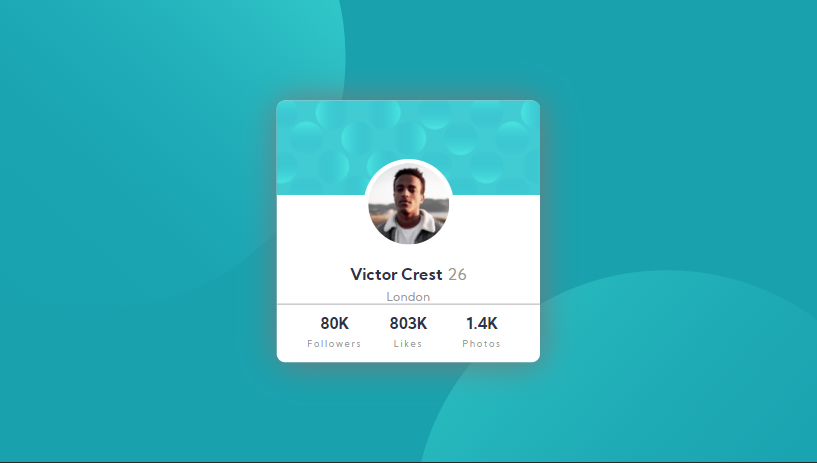

# Frontend Mentor - Profile card component solution

This is a solution to the [Profile card component challenge on Frontend Mentor](https://www.frontendmentor.io/challenges/profile-card-component-cfArpWshJ). Frontend Mentor challenges help you improve your coding skills by building realistic projects. 

## Table of contents

- [Frontend Mentor - Profile card component solution](#frontend-mentor---profile-card-component-solution)
  - [Table of contents](#table-of-contents)
  - [Overview](#overview)
    - [The challenge](#the-challenge)
    - [Screenshot](#screenshot)
    - [Links](#links)
  - [My process](#my-process)
    - [Built with](#built-with)
    - [What I learned](#what-i-learned)
    - [Continued development](#continued-development)
    - [Useful resources](#useful-resources)
  - [Author](#author)
  - [Acknowledgments](#acknowledgments)

## Overview
This is the solution to a frontend mentor challenge in which the participants had to make a responsive profile card design. 
I took this challenge too seriously :sweat_smile: as the participants were only instructed to make the design responsive for mobile devices and desktop devices, whereas I made it responsive for all kinds of devices - horizontal mobile devices and, vertical and horizontal tablet devices.

### The challenge

- Build out the project to the designs provided
- Make the design responsive
- Make a github repo for the project
- Host the project

### Screenshot

  Desktop Design

  Vertical Mobile Phone Design - Google Pixel 2

  Horizontal Mobile Phone Design - Google Pixel 2

  Horizontal Tablet Design - iPad

  Vertical Tablet Design - iPad

### Links

- [Solution URL](https://your-solution-url.com)
- [Live Site URL](https://hamiecod.github.io/profile-card)

## My process
- Made the directory structure and setup my local environment
- Made the design for mobile devices
- Made the design for tablet devices
- Made the design for desktops
- Made the design for miscellaneous devices :)

### Built with

- Semantic HTML5 markup
- Git
- SCSS 
- Flexbox
- CSS Grid
- Mobile-first workflow

### What I learned
- I learnt how to make a design responsive for **all** type of devices, as earlier I only made the designs responsive for a common kind of mobile devices
- I learnt semantic versioning
- I learnt the tagging and releases system of git/github

### Continued development
- I would like to learn how to deploy to netlify and heroku

### Useful resources

- [Image color picker](https://imagecolorpicker.com/) - This helped me in picking colors accurately from the `.jpg` designs provided as i am not a pro member :grimacing:.

## Author

- Website - [Hargunbeer Singh](https://hargunbeer.netlify.app)
- Frontend Mentor - [@hamiecod](https://www.frontendmentor.io/profile/hamiecod)
- Twitter - [@hargunbeer](https://www.twitter.com/hargunbeer)

## Acknowledgments
- Styx#5814 helped me on a issue in the challenge
